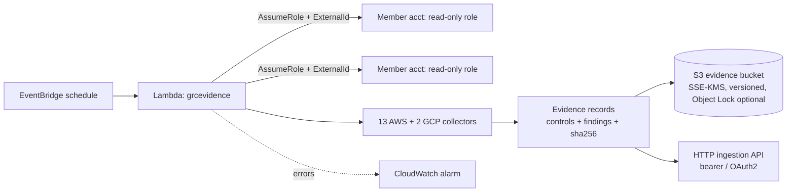

# grc-evidence-automation

[](https://github.com/DustyStudy/grc-evidence-automation/actions/workflows/ci.yml)
[](https://github.com/DustyStudy/grc-evidence-automation/actions/workflows/codeql.yml)
[](LICENSE)

**Scheduled, tamper-evident cloud control evidence, mapped to SOC 2, ISO/IEC 27001:2022, NIST SP 800-53 and FedRAMP 20x Key Security Indicators.**

Read-only Python collectors gather configuration evidence from AWS (and optionally GCP), tag each record with the SOC 2 criteria, ISO 27001 Annex A controls, NIST 800-53 controls and FedRAMP 20x KSIs it is relevant to, seal it with a SHA-256, and deliver it on a schedule to an encrypted S3 evidence store and/or a GRC-platform ingestion API. Deploys as a Lambda with Terraform.



Built for the "evidence, not screenshots" problem: a crosswalk in the spirit of FedRAMP control mapping, applied to the SOC 2 / ISO 27001 world where an auditor samples evidence over a period. `NIST 800-53` is included so an existing 800-53 control set maps straight across, and `fedramp_20x` maps the same evidence to the 46 [FedRAMP 20x Key Security Indicators](https://github.com/FedRAMP/rules) (Consolidated Rules 2026.09.13.02).

## What you get

| | |
|---|---|
| **15 collectors** | IAM (MFA, password policy, access-key hygiene, admin principals), S3 exposure and encryption, CloudTrail, KMS rotation, EBS/RDS encryption, security-group exposure, GuardDuty/Security Hub, AWS Config, VPC flow logs, backups; GCP Cloud Storage and firewall exposure. [Reference](docs/collectors.md) |
| **Control crosswalk** | Every collector maps to SOC 2 criteria, ISO 27001:2022 Annex A, NIST 800-53 controls and FedRAMP 20x KSIs, kept in [`collector_map.yaml`](src/grcevidence/data/collector_map.yaml) and validated in CI. |
| **Honest coverage report** | Shows which controls have automated evidence, and which technical controls are gaps. Organizational controls (policies, board oversight, HR) are marked as outside what any collector can prove. [SOC 2 / ISO / NIST coverage](docs/coverage.md) |
| **Integrity** | Every record and every run manifest carries a SHA-256. `grc-evidence verify` detects edited, missing and extra files. |
| **Failures are visible** | A check that cannot run (denied, throttled, service error) becomes an `error` record, never a silent pass. A failed delivery raises, so the Lambda alarm fires instead of leaving a quiet gap. |
| **Multi-account** | Assumes a read-only role in each member account with an `ExternalId`. Terraform for the collector and for the member-account role. GovCloud/China ARN partitions are handled. |
| **Sinks** | Local files, S3 (SSE-KMS), and a generic HTTP ingestion sink (bearer or OAuth2 client-credentials, retries, idempotency keys, no redirect following). |
| **Infrastructure** | [Terraform](deploy/terraform): Lambda, EventBridge schedule, KMS-encrypted versioned bucket with optional Object Lock, least-privilege IAM, error alarm. |

## Quick start

```bash
pip install -e ".[dev]"

# See what is covered and what is not
grc-evidence coverage
grc-evidence collectors

# Collect from the account your credentials point at, into ./evidence
grc-evidence collect --output ./evidence --regions us-east-1
grc-evidence verify ./evidence
grc-evidence report ./evidence --framework soc2      # or iso27001, nist_800_53, fedramp_20x
```

A collected record ([sample](docs/sample-evidence.json), [sample SOC 2 rollup](docs/sample-report.md)):

```json
{
  "collector": "aws.network_exposure",
  "account": "123456789012",
  "region": "us-east-1",
  "status": "fail",
  "summary": "2 security group(s) examined; 1 expose sensitive ports to the internet",
  "controls": {"soc2": ["CC6.6"], "iso27001": ["A.8.20", "A.8.22"], "nist_800_53": ["SC-7"], "fedramp_20x": ["KSI-CNA-MAT", "KSI-CNA-RNT", "KSI-CNA-ULN"]},
  "findings": [{"resource": "sg-e70e... (legacy-bastion)", "message": "Port 22/tcp open to the internet", "severity": "high"}],
  "sha256": "639dd515fc0567bc2a89e2c63605b43b5adbca3d1efc7a47d5ae1672b5b8e6b1"
}
```

## Configuration

```yaml
# grc.yaml   (see examples/config.example.yaml)
accounts:
  - id: "111111111111"
    name: prod
    role_arn: arn:aws:iam::111111111111:role/GrcEvidenceReader
    external_id: 3f9c1c2e-replace-with-a-random-value
    regions: [us-east-1, us-west-2]
regions: [us-east-1]                 # default for accounts without their own list
collectors:
  exclude: [aws.backups]
parameters:                          # thresholds; set these to YOUR policy
  max_access_key_age_days: 90
  password_min_length: 14
  sensitive_ports: [22, 3389]
gcp:
  projects: [my-project]             # needs the [gcp] extra and Application Default Credentials
sinks:
  - {type: local, path: ./evidence}
  - {type: s3, bucket: my-evidence-bucket, prefix: evidence, kms_key_id: alias/grc-evidence}
  - type: http
    url: https://ingest.example.com/v1/evidence
    format: bundle                   # one POST per run, or per_evidence
    auth: {type: bearer, token: "secretsmanager:grc/ingest-token"}
```

Unknown keys are errors. Secrets are references (`env:`, `secretsmanager:`, `ssm:`), and bare literals are rejected so credentials cannot end up in the config file.

## Deploy

```bash
python scripts/build_lambda.py                      # dist/grc-evidence-lambda.zip (Linux wheels for the Lambda runtime)
```

```hcl
module "grc_evidence" {
  source           = "./deploy/terraform"
  lambda_zip_path  = "dist/grc-evidence-lambda.zip"
  schedule_expression = "cron(0 6 * * ? *)"
  object_lock_days = 365                            # optional immutability for the evidence bucket
  target_role_arns = [module.reader_prod.role_arn]
  alarm_actions    = [aws_sns_topic.security.arn]
  collector_config = {
    regions  = ["us-east-1"]
    accounts = [{ id = "111111111111", role_arn = module.reader_prod.role_arn, external_id = var.external_id }]
  }
}

module "reader_prod" {                               # applied in each member account
  source           = "./deploy/terraform/reader_role"
  trusted_role_arn = module.grc_evidence.function_role_arn
  external_id      = var.external_id
}
```

Invoke once with `{"dry_run": true}` to check permissions before the first scheduled run. The IAM policy is exactly the read-only action list the collectors use; `grc-evidence permissions` prints it and a test fails if the Terraform drifts from it. See [deploy/terraform/README.md](deploy/terraform/README.md).

## Delivering to a GRC platform

The HTTP sink is intentionally vendor-neutral. It POSTs this project's JSON schema to a URL you configure and handles auth, retries, idempotency and safe redirect behaviour. GRC platforms differ in endpoint and payload shape, so you either wrap fields with `payload_template` or put a small adapter in front. **The sink has not been verified against any specific vendor's API**; see [docs/INGESTION.md](docs/INGESTION.md) for the contract and what to check before pointing it at one.

## What automated evidence does and does not do

- It shows configuration state at collection time, over time, with integrity protection. That is useful audit evidence for *technical* controls.
- It does **not** establish that a control is effective or that you are compliant. Auditors decide that, and for SOC 2 they choose the criteria in scope. Mapping a collector to a criterion means "relevant to", not "satisfies".
- Organizational criteria (governance, HR, vendor management, incident response) need documents and records outside any cloud API. They are listed in the coverage report as such.
- Thresholds (key age, password length, backup retention) default to common benchmark values. Set them to what your policy says, because that is what gets tested.
- The FedRAMP 20x mapping is *relevant-to* evidence for the machine-checkable part of a KSI. It is not a FedRAMP authorization artifact, is not in FedRAMP's machine-readable submission format, and does not replace validation by FedRAMP or an assessor. Which KSIs apply depends on your Certification Class, and FedRAMP revises the KSI set, so the catalog pins the version it was built from.
- Control titles are short paraphrases, not the standards' text. Check the crosswalk with your auditor before relying on it.

## Limitations

- GCP collectors are unit-tested against fakes shaped like the `google-cloud-storage` / `google-cloud-compute` objects and have not been run against a live project by this repo's CI.
- AWS collectors are tested against [moto](https://github.com/getmoto/moto). moto does not model everything (for example `GetBucketPolicyStatus` evaluation), so those paths use stub clients.
- Resource inspection is capped per collector per region (`max_items_per_check`, default 500) and records say when they were truncated.
- Single-region checks use the region list you configure; add every region you use, including ones you think are empty (GuardDuty and Config gaps live there).
- No auto-remediation. This tool observes only.

## Development

```bash
pip install -e ".[dev]"
ruff check src tests scripts && ruff format --check src tests scripts
mypy src
pytest --cov=grcevidence
terraform -chdir=deploy/terraform fmt -check -recursive
```

Regenerate docs after changing collectors or the crosswalk:

```bash
grc-evidence coverage --format markdown > docs/coverage.md
grc-evidence collectors --format markdown > docs/collectors.md
```

Tests fail if these are stale. See [CONTRIBUTING.md](CONTRIBUTING.md), [SECURITY.md](SECURITY.md) and [docs/ARCHITECTURE.md](docs/ARCHITECTURE.md).

## License

MIT
